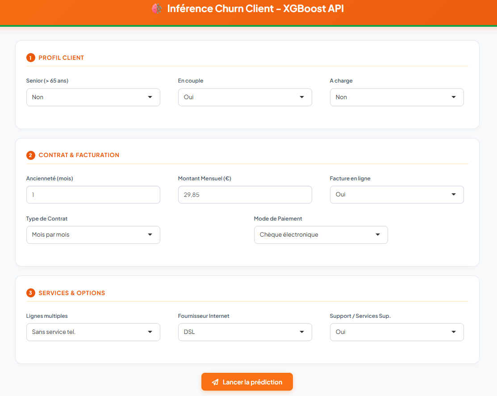
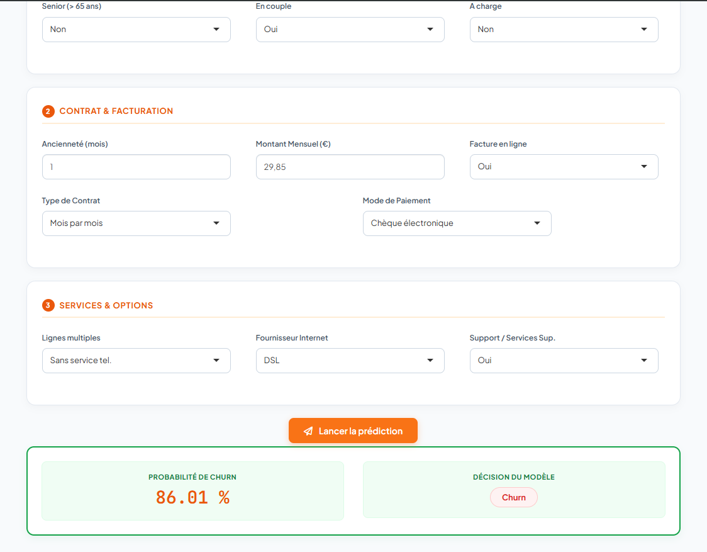

---

editor_options: 
  markdown: 
    wrap: 72
---

::: {align="center"}
## Telco Churn Prediction — R - XGBoost - Shiny - Docker

**Prédiction du churn client d'un opérateur télécom, de l'analyse exploratoire jusqu'à une application interactive déployée.**

Auteur : @Madiba

[](https://www.r-project.org/) [](https://shiny.rstudio.com/) [](https://xgboost.readthedocs.io/) [](https://www.docker.com/) [](https://hub.docker.com/) [](https://github.com/features/actions)
:::

------------------------------------------------------------------------

## Sommaire

- [Aperçu du projet](#-aperçu-du-projet)
- [Jeu de données](#-jeu-de-données)
- [Étapes du projet (Data Science)](#-étapes-du-projet-data-science)
- [Packages utilisés](#-packages-utilisés)
- [Architecture technique](#️-architecture-technique)
- [Démarrage rapide](#-démarrage-rapide)
- [Structure du dépôt](#-structure-du-dépôt)
- [API de scoring](#-api-de-scoring)
- [Application Shiny](#-application-shiny)
- [CI/CD & Images Docker publiques](#-cicd--images-docker-publiques)
- [État actuel de la production & feuille de route](#-état-actuel-de-la-production--feuille-de-route)
- [Documentation complémentaire](#-documentation-complémentaire)
- [Licence](#-licence)

------------------------------------------------------------------------

## Aperçu du projet

- **Langage principal :** R
- **Algorithme utilisé :** XGBoostClassifier
- **Type de problème :** Classification binaire
- **Objectif :** Identifier les clients susceptibles de résilier leur contrat (*churn*) afin de proposer des mesures de rétention ciblées.

Grâce à l'exploitation des données clients, l'entreprise peut : - Anticiper le départ des abonnés, - Optimiser ses campagnes marketing de fidélisation, - Réduire la perte de revenus liée au churn.

Ce projet illustre une approche complète : de l'analyse exploratoire à l'interprétation du modèle, jusqu'à une **API de scoring en production** consommée par une **interface Shiny interactive**, le tout conteneurisé et publié automatiquement via un pipeline CI/CD.

------------------------------------------------------------------------

## Jeu de données

**Variable cible :** `Churn` (Oui / Non) — indique si le client a résilié son contrat.

| Catégorie | Variables |
|------------------------------------|------------------------------------|
| **Services souscrits** | Téléphonie (ligne simple/multiple), Internet (DSL, fibre optique), sécurité en ligne, sauvegarde, support technique, protection d'appareil, streaming TV/films |
| **Informations de compte** | Ancienneté, type de contrat (mensuel/annuel/biannuel), mode de paiement, facturation électronique, montant mensuel, total des dépenses cumulées |
| **Données démographiques** | Genre, présence d'un partenaire, personnes à charge |

------------------------------------------------------------------------

## Étapes du projet (Data Science)

1.  Importation des données
2.  Prétraitement des données
3.  Analyse exploratoire (EDA)
4.  Sélection de variables pertinentes
5.  Entraînement et évaluation du modèle `XGBoostClassifier`
6.  Interprétation du modèle (SHAP)
7.  Industrialisation : API REST de scoring (Plumber)
8.  Application Shiny interactive pour tester les prédictions
9.  Conteneurisation Docker et déploiement
10. Automatisation CI/CD (build & publication des images)

------------------------------------------------------------------------

## Packages utilisés

| Catégorie | Packages | Rôle principal |
|------------------------|------------------------|------------------------|
| Manipulation & visualisation | `tidyverse`, `dplyr`, `ggplot2`, `purrr` | Nettoyage, transformation et visualisation des données |
| Exploration & diagnostic | `DataExplorer`, `dlookr`, `naniar`, `ggstatsplot` | Analyse exploratoire, détection des valeurs manquantes et corrélations |
| Modélisation | `xgboost`, `caret`, `pROC` | Entraînement, tuning et évaluation du modèle |
| Interprétation du modèle | `SHAPforxgboost` | Calcul et visualisation des valeurs SHAP |
| Application | `shiny`, `bslib`, `httr2`, `jsonlite` | Interface utilisateur et communication avec l'API |
| API | `plumber`, `recipes` | Exposition du modèle via une API REST |

------------------------------------------------------------------------

## Architecture technique

Le modèle entraîné est exposé via une **API REST** consommée par une **interface Shiny**, les deux étant conteneurisés indépendamment et orchestrés ensemble.

```         
┌──────────────────────┐        réseau Docker interne        ┌──────────────────────────┐
│   Conteneur shiny    │  ────────────────────────────────▶  │    Conteneur api        │
│  (port 3838, public) │      http://api:8080/predict        │  (port 8080, interne)    │
└──────────────────────┘  ◀────────────────────────────────  └─────────────────────────┘
         ▲
         │ port 3838
     Utilisateur final
```

| Service | Rôle                                         | Technologie |
|---------|----------------------------------------------|-------------|
| `api`   | Scoring / inférence du modèle XGBoost        | R + Plumber |
| `shiny` | Interface utilisateur (formulaire de saisie) | R + Shiny   |

Les deux services communiquent par **nom de service Docker** (`http://api:8080`), et non par `127.0.0.1` — voir la section [Documentation complémentaire](#-documentation-complémentaire) pour le détail de ce point d'attention.

------------------------------------------------------------------------

## Démarrage rapide

### Prérequis

- Docker
- Artefacts du modèle présents dans `api/models/`

### Lancer l'application

``` bash
# Cloner le dépôt
git clone https://github.com/Schaphath/MLops-Project-Tuto-R.git
cd <MLops-Project-Tuto-R>

# Build et démarrage des deux services
docker compose up -d --build
```

L'application est ensuite accessible sur :

```         
http://localhost:3838
```

### Commandes utiles

``` bash
docker compose ps              # état des services
docker compose logs -f api     # logs de l'API
docker compose logs -f shiny   # logs de l'interface
docker compose down            # arrêt
```

------------------------------------------------------------------------

## Structure globale du dépôt

```         
MLops-Project-Tuto-R/
├── docker-compose.yml
├── api/
│   ├── Dockerfile
│   ├── plumber.R
│   └── models/
│       ├── xgb-classifier-model.json
│       ├── xgb-model-features.rds
│       ├── recipe_prep.rds
│       └── optimal_threshold.rds
├── app/
│   ├── Dockerfile
│   └── shiny.R
└── .github/
    └── workflows/
        └── deploy-docker.yml
```

------------------------------------------------------------------------

## API de scoring

L'API expose deux endpoints principaux :

| Endpoint | Méthode | Rôle |
|------------------------|------------------------|------------------------|
| `/health` | `GET` | Vérifie que les artefacts du modèle sont chargés et opérationnels |
| `/predict` | `POST` | Reçoit un ou plusieurs profils clients (JSON) et retourne la probabilité de churn |

**Exemple d'appel :**

``` bash
curl -X POST http://localhost:8080/predict \
  -H "Content-Type: application/json" \
  -d '[{"tenure": 1, "MonthlyCharges": 29.85, "Contract_Month_to_month": 1, ...}]'
```

**Réponse :**

``` json
[
  {
    "id_client": "CLIENT_1",
    "churn_proba": 0.7321,
    "churn_class": 1,
    "decision": "Churn"
  }
]
```

📄 Le détail complet des paramètres, validations et codes d'erreur est disponible dans la [documentation technique de l'API](#-documentation-complémentaire).

------------------------------------------------------------------------

## Application Shiny

Une application Shiny a été développée pour :

- Permettre des tests interactifs avec différents profils clients,

- Illustrer de manière intuitive comment les variables influencent la décision du modèle.

Le formulaire est organisé en **trois sections** :

1.  **Profil Client** — données démographiques

2.  **Contrat & Facturation** — ancienneté, montant, type de contrat, mode de paiement

3.  **Services & Options** — lignes multiples, internet, support

Au clic sur *"Lancer la prédiction"*, l'interface interroge l'API et affiche la probabilité de churn ainsi que la décision du modèle sous forme de badge.

------------------------------------------------------------------------

## CI/CD & Images Docker publiques

Les images sont construites et publiées automatiquement sur Docker Hub à chaque mise à jour du code (`main`), via GitHub Actions.

``` bash
docker pull <votre-user-dockerhub>/xgb-plumber-api:latest
docker pull <votre-user-dockerhub>/xgb-shiny-app:latest
```

Le pipeline CI/CD (`.github/workflows/deploy-docker.yml`) :

- construit les deux images en parallèle,

- les publie avec un tag `latest` et un tag versionné (`vX.Y.Z` sur les tags Git),

- met à jour automatiquement la description Docker Hub des dépôts.

------------------------------------------------------------------------

## État actuel de la production & feuille de route

**⚠️ Important :** les versions actuellement déployées sont les suivantes :

| Composant | Version en production | Caractéristiques |
|------------------------|------------------------|------------------------|
| API (`plumber.R`) | **v1.2.0** | Sans authentification, CORS ouvert, validations de base (colonnes, bornes) |
| Interface (`shiny.R`) | **v1.2** (formulaire restructuré en 3 sections) | Sans clé API, logique de communication avec l'API inchangée |

Une **version durcie de l'API (v1.3.0)** et son **interface compatible** ont été développées et documentées, mais **ne sont pas encore déployées**. Elles introduisent :

- authentification par clé API (`X-API-Key`) sur `/predict`,
- rejet explicite des valeurs manquantes (`tenure`/`MonthlyCharges`),
- validation stricte des variables indicatrices (0/1),
- restriction CORS configurable,
- limites de taille de payload et de nombre de clients par requête,
- `/health` avec test d'inférence de bout en bout,
- logging structuré (JSON) avec identifiant de corrélation par requête,
- traçabilité de la version du modèle dans chaque réponse (`model_version`).

**Ce que ça signifie concrètement :** les documents techniques référencés ci-dessous présentent ces axes d'amélioration comme *recommandés* (v1.2.0) ou *déjà implémentés dans une version prête à déployer mais non encore mise en ligne* (v1.3.0). Se référer au tableau ci-dessus pour savoir quel comportement est réellement actif en production à ce jour.

| Priorité | Amélioration | Statut |
|------------------------|------------------------|------------------------|
| Haute | Authentification par clé API | ✅ Prête (v1.3.0) — ⏳ non déployée |
| Haute | Rejet des valeurs manquantes | ✅ Prête (v1.3.0) — ⏳ non déployée |
| Moyenne | Validation des colonnes dummifiées | ✅ Prête (v1.3.0) — ⏳ non déployée |
| Moyenne | Restriction CORS | ✅ Prête (v1.3.0) — ⏳ non déployée |
| Moyenne | Logging structuré | ✅ Prête (v1.3.0) — ⏳ non déployée |
| Moyenne | Limites de payload / batch | ✅ Prête (v1.3.0) — ⏳ non déployée |
| Basse | `/health` avec test d'inférence | ✅ Prête (v1.3.0) — ⏳ non déployée |
| Basse | `model_version` dans les réponses | ✅ Prête (v1.3.0) — ⏳ non déployée |
| — | Mode batch côté interface (upload multi-clients) | ⏳ Non développée |
| — | Limitation de débit (rate limiting) | ⏳ Non développée |

------------------------------------------------------------------------

## Documentation complémentaire

| Document | Contenu |
|------------------------------------|------------------------------------|
| `DOCUMENTATION_TECHNIQUE.md` | Vue d'ensemble de l'architecture, endpoints, déploiement |
| `DOC_TECHNIQUE_API_v1.3.0.md` | Détail de l'API durcie (non encore déployée) |
| `DOC_TECHNIQUE_SHINY_v1.2.md` | Détail de l'interface Shiny (formulaire, flux, configuration) |
| `REX_PROJET.md` | Retour sur expérience : difficultés rencontrées et solutions apportées |

------------------------------------------------------------------------

## Aperçu de l'interface de l'application




