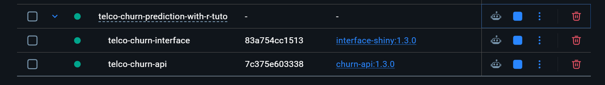
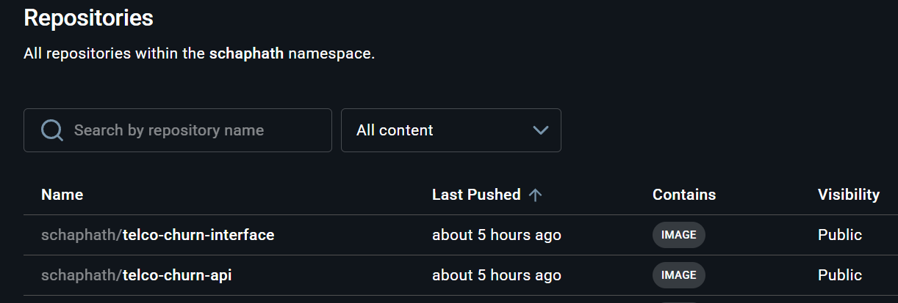
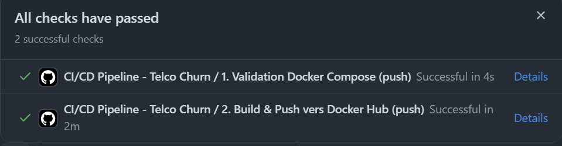

# Projet risque d'attrition : R, XGBoost, Plumber, RShiny, Docker et GitHub Actions

**Prédiction du risque d'attrition d'un opérateur de télécommunication, de l'analyse exploratoire jusqu'à une application interactive déployée.**

---

> L'objectif n'est pas d'obtenir le meilleur modèle absolu, mais plutôt d'illustrer les différentes étapes d'un projet de machine learning moderne.

---

Auteur : @Madiba

[](https://www.r-project.org/)
[](https://shiny.rstudio.com/)
[](https://www.rplumber.io/)
[](https://xgboost.readthedocs.io/)
[](https://www.docker.com/)
[](https://hub.docker.com/)
[](https://github.com/features/actions)

---

### Aperçu du projet

- **Langage principal :** R
- **Algorithme utilisé :** XGBoostClassifier
- **Type de problème :** Classification binaire
- **Objectif :** Identifier les clients susceptibles de *résilier leur contrat* afin de proposer des mesures de rétention ciblées.

Grâce à l'exploitation des données clients, l'entreprise peut :

- Anticiper le départ des abonnés,
- Réduire la perte de revenus liée au churn,
- Identifier le profil type du client à risque,
- Optimiser ses campagnes marketing de fidélisation,
- Comprendre les facteurs susceptibles d'influencer le départ d'un client.

Ce projet illustre une approche complète : de l'analyse exploratoire à l'interprétation du modèle, jusqu'à la mise à disposition du modèle via une **API** et une **interface web**.

---

### Répertoire réduit du dépôt

```
MLops-Project-Tuto-R/
├── docker-compose.yml
├── api/
│   ├── Dockerfile
│   ├── api.R
│   └── models/
│       ├── xgb-classifier-model.json
│       ├── xgb-model-features.rds
│       ├── caret_prep.rds
│       └── optimal_threshold.rds
├── app/
│   ├── Dockerfile
│   └── shiny.R
└── .github/
    └── workflows/
        └── docker-hub.yml
```

---

### Jeu de données

- **Nombre de lignes :** 7043
- **Nombre de colonnes :** 21
- **Variable cible :** `Churn` (Oui / Non) — indique si le client a résilié son contrat.

| Catégorie | Variables |
|---|---|
| **Services souscrits** | Téléphonie (ligne simple/multiple), Internet (DSL, fibre optique), sécurité en ligne, sauvegarde, support technique, protection d'appareil, streaming TV/films |
| **Informations de compte** | Ancienneté, type de contrat (mensuel/annuel/biannuel), mode de paiement, charge mensuelle, charge totale cumulée |
| **Données démographiques** | Genre, présence d'un partenaire, personnes à charge |

---

### Étapes du projet

1. Importation des données
2. Analyse exploratoire (EDA)
3. Préparation des données pour le ML
4. Entraînement et évaluation du modèle `XGBoostClassifier`
5. Interprétation du modèle (SHAP)
6. API REST de scoring (Plumber)
7. Interface web (Shiny)
8. Conteneurisation des images Docker
9. Automatisation CI/CD (build & publication des images)
10. Hébergement sur Docker Hub

---

### Packages utilisés

| Catégorie | Principaux packages | Rôle principal |
|---|---|---|
| Manipulation & visualisation | `tidyverse`, `dplyr`, `ggplot2`, `purrr` | Nettoyage, transformation et visualisation des données |
| Exploration & diagnostic | `DataExplorer`, `dlookr`, `ggstatsplot` | Analyse exploratoire et tests statistiques |
| Machine Learning | `xgboost`, `caret`, `pROC` | Entraînement, tuning et évaluation du modèle |
| Interprétation du modèle | `SHAPforxgboost` | Calcul et visualisation des valeurs SHAP |
| Interface web | `shiny`, `bslib`, `httr2`, `jsonlite`, `DT` | Interface utilisateur et communication avec l'API |
| API | `plumber`, `jsonlite` | Exposition du modèle via une API REST |

---

### Architecture technique

Le modèle entraîné est exposé via une **API REST** consommée par une **interface Shiny**, les deux étant conteneurisées via un `docker-compose`.

```
┌──────────────────────┐        réseau Docker interne         ┌──────────────────────────┐
│   Conteneur shiny    │  ────────────────────────────────▶   │      Conteneur api       │
│ (port 3838, public)  │      http://api:8080/predict         │  (port 8080, interne)    │
└──────────────────────┘  ◀────────────────────────────────   └──────────────────────────┘
          ▲
          │ port 3838
      Utilisateur final
```

| Service | Rôle | Technologie |
|---|---|---|
| `api` | Scoring / inférence du modèle XGBoost | R + Plumber |
| `Interface` | Interface utilisateur (formulaire de saisie) | R + Shiny |

---

### Démarrage rapide

#### Prérequis

- R
- Git
- Compte GitHub
- Compte Docker Hub
- Docker Desktop sur Windows
- Artefacts du modèle présents dans `api/models/`

---

#### Lancer l'application

```bash
# Clonez le dépôt
git clone https://github.com/Schaphath/MLops-Project-Tuto-R.git
cd MLops-Project-Tuto-R

# À la racine du dossier, tapez la commande suivante pour construire les conteneurs :
docker compose up -d --build
```

Ensuite, ouvrez Docker Desktop et vous devriez normalement avoir les conteneurs en vert, comme c'est le cas dans l'image ci-dessous :



---

#### Quelques commandes utiles

```bash
docker compose ps                            # état des conteneurs
docker compose logs -f telco-churn-api       # logs du service API
docker compose logs -f telco-churn-interface # logs du service Shiny
docker compose down                          # arrêt et suppression des conteneurs
```

---

#### L'API expose deux principaux endpoints

| Endpoint | Méthode | Rôle |
|---|---|---|
| `/health` | `GET` | Vérifie que les artefacts du modèle sont chargés et opérationnels |
| `/predict` | `POST` | Reçoit un ou plusieurs profils clients (JSON) et retourne la probabilité de churn |

**Exemple d'appel :**

```bash
curl -X POST http://localhost:8080/predict \
  -H "Content-Type: application/json" \
  -d '[{"tenure": 1, "MonthlyCharges": 29.85, "Contract_Month_to_month": 1, ...}]'
```

**Réponse :**

```json
[
  {
    "id_client": "CLIENT_1",
    "churn_proba": 0.7321,
    "churn_class": 1,
    "decision": "Churn",
    "Version_model": "1.2.0"
  }
]
```

---

### Application Shiny

Le formulaire est organisé en **trois sections** :

1. **Profil Client :** données démographiques
2. **Contrat & Facturation :** ancienneté, montant, type de contrat, mode de paiement
3. **Services & Options :** lignes multiples, internet, support

Au clic sur *« Lancer la prédiction »*, l'interface interroge l'API et affiche la probabilité de churn ainsi que la décision du modèle sous forme de badge.

#### Aperçu de l'application


---

### API Plumber


L'API de scoring est construite avec **Plumber**, qui expose le modèle XGBoost entraîné sous forme d'endpoints REST directement depuis R.

---

### CI/CD & Images Docker publiques

Les images sont construites et publiées automatiquement sur Docker Hub à chaque mise à jour du code sur la branche `main`, via GitHub Actions.

```bash
docker pull schaphath/telco-churn-api:1.2.3
docker pull schaphath/telco-churn-interface:1.2.3
```



Le pipeline CI/CD (`.github/workflows/docker-hub.yml`) :

- construit les deux images en parallèle,
- les publie avec un tag `latest` et un tag versionné (`vX.Y.Z` sur les tags Git).



---

> ⚠️ **Important :** Vous pouvez utiliser et adapter ce code librement. Merci de simplement créditer l'auteur d'origine.